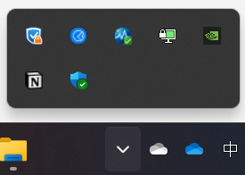
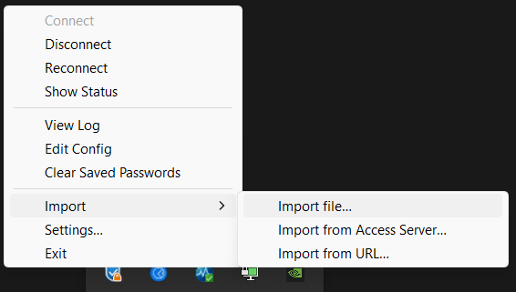

# sFlow implementation on p4 hardware switch

## 編譯

```shell
make build
```

## 啟動

請分別在兩個不同的 console 開啟

```shell
make bfrt # 啟動 switchd
```
```shell
make test # 啟動 p4runtime
```

如不依靠 p4runtime，可以使用 bfrt_python 操作，在 bfrt_python 內可以使用 `tab` 鍵自動補全

```shell
make bfrt
ucli
pm
port-add 12/0 10G NONE
port-add 12/3 10G NONE
port-enb 12/0
port-enb 12/3
exit
bfrt_python
ig = bfrt.simple_switch.pipe.MyIngress
ig.ipv4_table.add_with_ipv4_forward(dst_addr="10.10.3.1", port=144)
ig.ipv4_table.add_with_ipv4_forward(dst_addr="10.10.3.2", port=147)
ig.ipv4_table.dump
```

## 檔案

- `simple_switch.p4`
為主要的 p4 程式，每次修改後須重新編譯後再啟動

- `simple_switch_test.py`
為 controller，添加初始 rules，並作為 sFlow agent

- `sflow.py`
定義了 sFlowAgent class

- `const.py`
為所有設定放置的地方，包括 host IP, port, mac address

- `common/`
此資料夾為 tofino 本身內建的資料夾，除非需要調整 parse header 否則不須更改

- `open_cpu_port.sh`
啟用 CPU 網路介面

- `ports.json`
定義網路介面與 port 的對應關係

- `p4-opn-udp/`
為 VPN file

- `udp_sender.c`
為不斷發送 UDP 封包的的程式

- `estimated.sh`
從 `statistics.txt` 讀資料，計算 CPU usage 跟 packet arrival rate，再存到 `results.txt`

## 修改時的注意事項

### 檔名

因為switch在編譯時是以 `.p4` 主程式的檔名來辨認，因此請記得修改所有 `simple_switch` 出現的地方。包含

- 檔名
- Makefile 內的檔名
- `simple_switch_test.py` 內的
    - class 名稱 (需與 `Makefile` 內的對應)
    ```python
    self.p4_name = test_param_get("simple_switch", "")
    ```

## 遠端連線

請先設定 VPN 再透過 SSH 連線

### VPN
1. 安裝 OpenVPN
2. 右鍵點選 OpenVPN 的圖示 (鎖加電腦那個)

    
3. 匯入 VPN file，選擇 `p4-opn-udp/p4-opn-udp-1194.ovpn`

    
4. 右鍵點選 OpenVPN 的圖示，按 `Connect`
5. 輸入帳號密碼連線，圖示變成綠色代表連線成功
    - username: `p4sywang`
    - password: `nslab@215`

### SSH

可以在 CLI 直接使用 ssh 指令連線或是用 VSCode 的 remote ssh 連線

- 連線到 p4 switch
    - username: `root`
    - password: `onl`
    ```bash
    ssh root@192.168.132.103
    ```

- 連線到 h1
    - username: `p4user`
    - password: `p4user`
    ```bash
    ssh p4user@192.168.132.31
    ```

- 連線到 h2
    - username: `p4user`
    - password: `p4user`
    ```bash
    ssh p4user@192.168.132.32
    ```

## 實驗操作

0. 如果有修改 p4 程式，需執行 `make build` 重新編譯

1. 在 switch 上開兩個 console 分別執行 `make bfrt` 跟 `make test` ，啟動 switchd 跟 p4runtime

2. 在 host 編譯 `udp_sender.c` 並執行，開始發送封包

3. 在 switch 上執行 `estimate.sh` 計算效能

4. `Ctrl+C` 結束 `make test` ， `Ctrl+\` 結束 `make bfrt`
